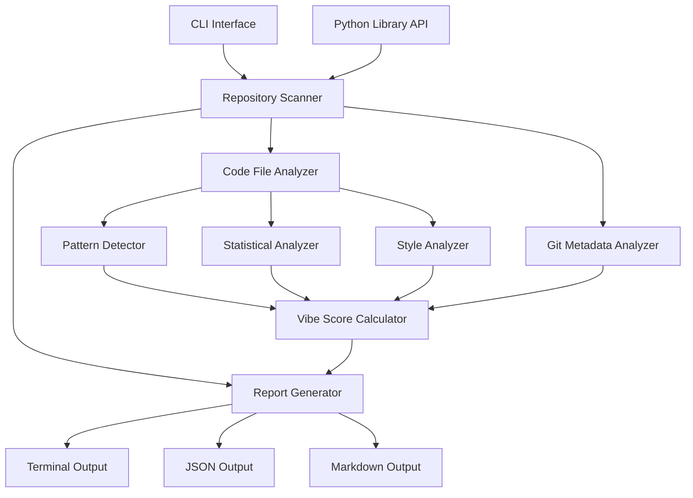
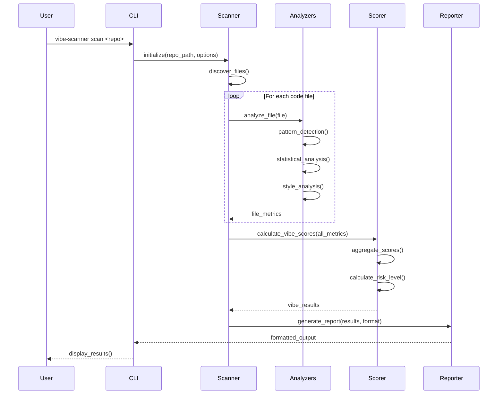

# Design Document: vibe-scanner

## Overview

vibe-scanner is an open-source CLI tool and Python library that detects AI-generated code in repositories. The system analyzes code files using multiple detection methods including statistical analysis (perplexity scoring, code predictability), metadata mining (git authoring speed, commit patterns), and stylometric analysis (coding style consistency, linguistic fingerprinting). The tool produces a Vibe Score (0-100%) indicating the likelihood that code was AI-generated, with support for file-level, line-level, and repository-level analysis. The architecture is designed to be extensible, allowing easy addition of new detection methods, and operates offline without requiring external API calls for basic detection. The MVP focuses on local and GitHub repository scanning with multiple output formats (terminal, JSON, markdown) while maintaining the flexibility to support future SaaS features like multi-repo dashboards and team analytics.

## Architecture



## Main Algorithm/Workflow




## Components and Interfaces

### Component 1: CLI Interface

**Purpose**: Provides command-line interface for users to interact with vibe-scanner

**Interface**:
```python
class CLIInterface:
    def scan(repo_path: str, options: ScanOptions) -> int
    def version() -> str
    def help() -> str
```

**Responsibilities**:
- Parse command-line arguments
- Validate input parameters
- Initialize scanner with appropriate configuration
- Display progress indicators
- Format and display output to terminal
- Handle errors and exit codes

### Component 2: Repository Scanner

**Purpose**: Orchestrates the scanning process across all files in a repository

**Interface**:
```python
class RepositoryScanner:
    def __init__(config: ScanConfig)
    def scan(repo_path: str) -> ScanResult
    def discover_files(repo_path: str, filters: FileFilters) -> List[FilePath]
    def analyze_repository(files: List[FilePath]) -> RepositoryMetrics
```


**Responsibilities**:
- Discover all code files in repository
- Filter files based on configuration (ignore patterns, file types)
- Coordinate analysis across multiple analyzers
- Aggregate results from all files
- Manage parallel processing for performance

### Component 3: Code File Analyzer

**Purpose**: Analyzes individual code files using multiple detection methods

**Interface**:
```python
class CodeFileAnalyzer:
    def __init__(detectors: List[Detector])
    def analyze_file(file_path: str) -> FileAnalysisResult
    def analyze_lines(file_content: str) -> List[LineScore]
    def get_file_metrics(analysis: FileAnalysisResult) -> FileMetrics
```

**Responsibilities**:
- Read and parse code files
- Apply all registered detectors
- Combine detection results
- Calculate per-file metrics
- Handle parsing errors gracefully

### Component 4: Pattern Detector

**Purpose**: Detects AI-generated code patterns and signatures


**Interface**:
```python
class PatternDetector:
    def detect(code: str, language: str) -> PatternScore
    def check_comment_patterns(code: str) -> float
    def check_complexity_uniformity(ast: AST) -> float
    def check_hallucination_patterns(code: str) -> List[HallucinationMatch]
```

**Responsibilities**:
- Identify common AI code generation patterns
- Detect uniform complexity across functions
- Find AI-specific comment styles
- Identify hallucination patterns (non-existent APIs, unusual patterns)
- Score pattern matches

### Component 5: Statistical Analyzer

**Purpose**: Performs statistical analysis on code characteristics

**Interface**:
```python
class StatisticalAnalyzer:
    def analyze(code: str, language: str) -> StatisticalScore
    def calculate_perplexity(tokens: List[Token]) -> float
    def calculate_predictability(code: str) -> float
    def analyze_token_distribution(tokens: List[Token]) -> Distribution
```


**Responsibilities**:
- Calculate code perplexity scores
- Measure code predictability
- Analyze token distribution patterns
- Detect statistical anomalies
- Compare against baseline distributions

### Component 6: Style Analyzer

**Purpose**: Analyzes coding style consistency and linguistic fingerprinting

**Interface**:
```python
class StyleAnalyzer:
    def analyze(code: str, language: str, context: StyleContext) -> StyleScore
    def extract_style_features(code: str) -> StyleFeatures
    def compare_with_baseline(features: StyleFeatures, baseline: StyleBaseline) -> float
    def detect_style_shifts(files: List[FileAnalysis]) -> List[StyleShift]
```

**Responsibilities**:
- Extract coding style features (indentation, naming, structure)
- Build developer style baseline from git history
- Detect deviations from established patterns
- Identify style inconsistencies
- Track style evolution over time


### Component 7: Git Metadata Analyzer

**Purpose**: Analyzes git commit patterns and authoring metadata

**Interface**:
```python
class GitMetadataAnalyzer:
    def analyze(repo_path: str) -> GitMetrics
    def analyze_commit_patterns(commits: List[Commit]) -> CommitPatternScore
    def calculate_authoring_speed(commits: List[Commit]) -> AuthoringMetrics
    def analyze_code_churn(file_path: str, history: GitHistory) -> ChurnMetrics
```

**Responsibilities**:
- Extract git commit history
- Analyze commit sizes and timing
- Calculate lines-per-minute metrics
- Detect unusual commit patterns
- Correlate code churn with AI likelihood

### Component 8: Vibe Score Calculator

**Purpose**: Aggregates all detection signals into final Vibe Scores

**Interface**:
```python
class VibeScoreCalculator:
    def calculate_file_score(metrics: FileMetrics) -> VibeScore
    def calculate_repo_score(file_scores: List[VibeScore]) -> RepoVibeScore
    def calculate_risk_level(score: VibeScore, context: FileContext) -> RiskLevel
    def aggregate_signals(signals: List[DetectionSignal]) -> float
```


**Responsibilities**:
- Weight and combine detection signals
- Calculate confidence intervals
- Determine risk levels (low/medium/high)
- Handle missing or incomplete data
- Provide score explanations

### Component 9: Report Generator

**Purpose**: Generates reports in multiple output formats

**Interface**:
```python
class ReportGenerator:
    def generate(results: ScanResult, format: OutputFormat) -> str
    def generate_terminal_report(results: ScanResult) -> str
    def generate_json_report(results: ScanResult) -> str
    def generate_markdown_report(results: ScanResult) -> str
```

**Responsibilities**:
- Format results for different output types
- Apply color coding for terminal output
- Generate structured JSON for CI/CD
- Create readable markdown reports
- Include visualizations and summaries

## Data Models


### Model 1: ScanConfig

```python
class ScanConfig:
    repo_path: str
    include_patterns: List[str]
    exclude_patterns: List[str]
    file_extensions: List[str]
    max_file_size: int
    parallel_workers: int
    enable_git_analysis: bool
    output_format: OutputFormat
    verbosity: int
```

**Validation Rules**:
- repo_path must exist and be readable
- max_file_size must be positive integer
- parallel_workers must be between 1 and CPU count
- output_format must be one of: terminal, json, markdown

### Model 2: VibeScore

```python
class VibeScore:
    overall_score: float  # 0-100
    confidence: float  # 0-1
    contributing_signals: Dict[str, float]
    risk_level: RiskLevel  # LOW, MEDIUM, HIGH
    explanation: str
    line_scores: Optional[List[LineScore]]
```


**Validation Rules**:
- overall_score must be between 0 and 100
- confidence must be between 0 and 1
- contributing_signals values must sum to overall_score
- risk_level must be LOW if score < 30, MEDIUM if 30-70, HIGH if > 70

### Model 3: FileAnalysisResult

```python
class FileAnalysisResult:
    file_path: str
    language: str
    total_lines: int
    code_lines: int
    vibe_score: VibeScore
    pattern_matches: List[PatternMatch]
    statistical_metrics: StatisticalMetrics
    style_metrics: StyleMetrics
    git_metrics: Optional[GitMetrics]
    analysis_timestamp: datetime
```

**Validation Rules**:
- file_path must be valid relative or absolute path
- total_lines must be >= code_lines
- code_lines must be non-negative
- language must be supported language identifier

### Model 4: ScanResult


```python
class ScanResult:
    repo_path: str
    scan_timestamp: datetime
    total_files_scanned: int
    total_lines_analyzed: int
    overall_vibe_score: VibeScore
    file_results: List[FileAnalysisResult]
    ai_generated_lines: int
    human_written_lines: int
    risk_summary: RiskSummary
    scan_duration: float
```

**Validation Rules**:
- total_files_scanned must equal length of file_results
- total_lines_analyzed must equal sum of all file code_lines
- ai_generated_lines + human_written_lines must equal total_lines_analyzed
- scan_duration must be positive

### Model 5: DetectionSignal

```python
class DetectionSignal:
    signal_type: SignalType  # PATTERN, STATISTICAL, STYLE, GIT
    signal_name: str
    score: float  # 0-100
    confidence: float  # 0-1
    weight: float  # 0-1
    evidence: List[Evidence]
    metadata: Dict[str, Any]
```


**Validation Rules**:
- score must be between 0 and 100
- confidence must be between 0 and 1
- weight must be between 0 and 1
- signal_type must be valid enum value
- evidence list must not be empty

## Algorithmic Pseudocode

### Main Scanning Algorithm

```pascal
ALGORITHM scanRepository(repoPath, config)
INPUT: repoPath of type String, config of type ScanConfig
OUTPUT: result of type ScanResult

BEGIN
  ASSERT directoryExists(repoPath) AND isReadable(repoPath)
  
  // Step 1: Initialize scanner components
  scanner ← initializeScanner(config)
  analyzers ← initializeAnalyzers(config)
  gitAnalyzer ← initializeGitAnalyzer(repoPath)
  
  // Step 2: Discover files to analyze
  files ← discoverFiles(repoPath, config.includePatterns, config.excludePatterns)
  ASSERT files IS NOT EMPTY
  
  // Step 3: Analyze each file with loop invariant
  fileResults ← EMPTY_LIST
  FOR each file IN files DO
    ASSERT allProcessedFilesValid(fileResults)
    
    fileAnalysis ← analyzeFile(file, analyzers, gitAnalyzer)
    fileResults.add(fileAnalysis)
  END FOR

  
  // Step 4: Calculate repository-level vibe score
  repoScore ← calculateRepoVibeScore(fileResults)
  
  // Step 5: Generate risk summary
  riskSummary ← generateRiskSummary(fileResults, repoScore)
  
  // Step 6: Create final result
  result ← createScanResult(repoPath, fileResults, repoScore, riskSummary)
  
  ASSERT result.isComplete() AND result.isValid()
  
  RETURN result
END
```

**Preconditions:**
- repoPath is a valid directory path
- repoPath is readable by the current user
- config is a valid ScanConfig object
- Required analyzers can be initialized

**Postconditions:**
- result contains analysis for all discovered files
- result.overall_vibe_score is between 0 and 100
- result.total_files_scanned equals length of fileResults
- All file results have valid vibe scores

**Loop Invariants:**
- All processed files have valid analysis results
- fileResults contains only FileAnalysisResult objects
- No duplicate files in fileResults


### File Analysis Algorithm

```pascal
ALGORITHM analyzeFile(filePath, analyzers, gitAnalyzer)
INPUT: filePath of type String, analyzers of type List[Analyzer], gitAnalyzer of type GitAnalyzer
OUTPUT: analysis of type FileAnalysisResult

BEGIN
  ASSERT fileExists(filePath) AND isReadable(filePath)
  
  // Step 1: Read and parse file
  content ← readFile(filePath)
  language ← detectLanguage(filePath, content)
  ast ← parseCode(content, language)
  
  // Step 2: Collect detection signals from all analyzers
  signals ← EMPTY_LIST
  FOR each analyzer IN analyzers DO
    ASSERT allCollectedSignalsValid(signals)
    
    signal ← analyzer.analyze(content, language, ast)
    IF signal.confidence > CONFIDENCE_THRESHOLD THEN
      signals.add(signal)
    END IF
  END FOR
  
  // Step 3: Analyze git metadata if available
  IF gitAnalyzer IS NOT NULL THEN
    gitMetrics ← gitAnalyzer.analyzeFile(filePath)
    gitSignal ← createGitSignal(gitMetrics)
    signals.add(gitSignal)
  END IF

  
  // Step 4: Calculate vibe score from signals
  vibeScore ← calculateVibeScore(signals)
  
  // Step 5: Create file analysis result
  analysis ← FileAnalysisResult(
    filePath,
    language,
    countLines(content),
    countCodeLines(content),
    vibeScore,
    extractPatternMatches(signals),
    extractStatisticalMetrics(signals),
    extractStyleMetrics(signals),
    gitMetrics
  )
  
  ASSERT analysis.isValid() AND vibeScore.overall_score >= 0 AND vibeScore.overall_score <= 100
  
  RETURN analysis
END
```

**Preconditions:**
- filePath exists and is readable
- analyzers list is not empty
- All analyzers are properly initialized
- File size is within configured limits

**Postconditions:**
- analysis contains valid vibe score
- analysis.vibe_score.overall_score is between 0 and 100
- analysis.language is detected correctly
- All metrics are properly populated

**Loop Invariants:**
- All collected signals have confidence > threshold
- signals list contains only valid DetectionSignal objects


### Vibe Score Calculation Algorithm

```pascal
ALGORITHM calculateVibeScore(signals)
INPUT: signals of type List[DetectionSignal]
OUTPUT: score of type VibeScore

BEGIN
  ASSERT signals IS NOT EMPTY
  
  // Step 1: Normalize and weight signals
  weightedScores ← EMPTY_MAP
  totalWeight ← 0
  
  FOR each signal IN signals DO
    ASSERT signal.confidence > 0 AND signal.weight > 0
    
    normalizedScore ← signal.score * signal.confidence
    weightedScore ← normalizedScore * signal.weight
    weightedScores[signal.signal_name] ← weightedScore
    totalWeight ← totalWeight + signal.weight
  END FOR
  
  // Step 2: Calculate overall score
  IF totalWeight > 0 THEN
    overallScore ← sum(weightedScores.values()) / totalWeight
  ELSE
    overallScore ← 0
  END IF
  
  // Step 3: Calculate confidence based on signal agreement
  confidence ← calculateSignalAgreement(signals)
  
  // Step 4: Determine risk level
  IF overallScore < 30 THEN
    riskLevel ← LOW
  ELSE IF overallScore < 70 THEN
    riskLevel ← MEDIUM
  ELSE
    riskLevel ← HIGH
  END IF

  
  // Step 5: Generate explanation
  explanation ← generateExplanation(signals, overallScore, riskLevel)
  
  // Step 6: Create vibe score object
  score ← VibeScore(
    overallScore,
    confidence,
    weightedScores,
    riskLevel,
    explanation,
    NULL  // line_scores calculated separately if needed
  )
  
  ASSERT score.overall_score >= 0 AND score.overall_score <= 100
  ASSERT score.confidence >= 0 AND score.confidence <= 1
  
  RETURN score
END
```

**Preconditions:**
- signals list is not empty
- All signals have valid score (0-100), confidence (0-1), and weight (0-1)
- All signal scores are properly normalized

**Postconditions:**
- score.overall_score is between 0 and 100
- score.confidence is between 0 and 1
- score.risk_level is correctly assigned based on overall_score
- score.contributing_signals contains all input signals

**Loop Invariants:**
- totalWeight is sum of all processed signal weights
- All weightedScores values are non-negative


### Pattern Detection Algorithm

```pascal
ALGORITHM detectPatterns(code, language, ast)
INPUT: code of type String, language of type String, ast of type AST
OUTPUT: signal of type DetectionSignal

BEGIN
  ASSERT code IS NOT EMPTY AND language IS VALID
  
  patternScores ← EMPTY_LIST
  evidence ← EMPTY_LIST
  
  // Check 1: Comment pattern analysis
  commentScore ← analyzeCommentPatterns(code)
  IF commentScore > PATTERN_THRESHOLD THEN
    patternScores.add(commentScore)
    evidence.add(Evidence("AI_COMMENT_STYLE", commentScore))
  END IF
  
  // Check 2: Complexity uniformity
  complexityScore ← analyzeComplexityUniformity(ast)
  IF complexityScore > PATTERN_THRESHOLD THEN
    patternScores.add(complexityScore)
    evidence.add(Evidence("UNIFORM_COMPLEXITY", complexityScore))
  END IF
  
  // Check 3: Hallucination patterns
  hallucinations ← detectHallucinations(code, language)
  IF hallucinations IS NOT EMPTY THEN
    hallucinationScore ← calculateHallucinationScore(hallucinations)
    patternScores.add(hallucinationScore)
    evidence.add(Evidence("HALLUCINATIONS", hallucinationScore, hallucinations))
  END IF

  
  // Check 4: AI-specific code patterns
  aiPatterns ← detectAICodePatterns(code, language)
  IF aiPatterns IS NOT EMPTY THEN
    aiPatternScore ← calculateAIPatternScore(aiPatterns)
    patternScores.add(aiPatternScore)
    evidence.add(Evidence("AI_CODE_PATTERNS", aiPatternScore, aiPatterns))
  END IF
  
  // Calculate overall pattern score
  IF patternScores IS NOT EMPTY THEN
    overallScore ← average(patternScores)
    confidence ← calculateConfidence(patternScores)
  ELSE
    overallScore ← 0
    confidence ← 0
  END IF
  
  signal ← DetectionSignal(
    PATTERN,
    "pattern_detection",
    overallScore,
    confidence,
    PATTERN_WEIGHT,
    evidence,
    createMetadata(patternScores)
  )
  
  ASSERT signal.score >= 0 AND signal.score <= 100
  
  RETURN signal
END
```

**Preconditions:**
- code is non-empty string
- language is supported language identifier
- ast is valid abstract syntax tree for the code

**Postconditions:**
- signal.score is between 0 and 100
- signal.confidence is between 0 and 1
- signal.evidence contains all detected patterns


### Statistical Analysis Algorithm

```pascal
ALGORITHM performStatisticalAnalysis(code, language)
INPUT: code of type String, language of type String
OUTPUT: signal of type DetectionSignal

BEGIN
  ASSERT code IS NOT EMPTY
  
  // Step 1: Tokenize code
  tokens ← tokenize(code, language)
  ASSERT tokens IS NOT EMPTY
  
  // Step 2: Calculate perplexity score
  perplexity ← calculatePerplexity(tokens)
  perplexityScore ← normalizePerplexity(perplexity)
  
  // Step 3: Calculate predictability
  predictability ← calculatePredictability(tokens)
  predictabilityScore ← normalizePredictability(predictability)
  
  // Step 4: Analyze token distribution
  distribution ← analyzeTokenDistribution(tokens)
  distributionScore ← scoreDistribution(distribution)
  
  // Step 5: Detect statistical anomalies
  anomalies ← detectAnomalies(tokens, distribution)
  anomalyScore ← scoreAnomalies(anomalies)
  
  // Step 6: Combine statistical metrics
  statisticalScores ← [perplexityScore, predictabilityScore, distributionScore, anomalyScore]
  overallScore ← weightedAverage(statisticalScores, STATISTICAL_WEIGHTS)
  confidence ← calculateStatisticalConfidence(statisticalScores)

  
  evidence ← [
    Evidence("PERPLEXITY", perplexityScore, perplexity),
    Evidence("PREDICTABILITY", predictabilityScore, predictability),
    Evidence("DISTRIBUTION", distributionScore, distribution),
    Evidence("ANOMALIES", anomalyScore, anomalies)
  ]
  
  signal ← DetectionSignal(
    STATISTICAL,
    "statistical_analysis",
    overallScore,
    confidence,
    STATISTICAL_WEIGHT,
    evidence,
    createStatisticalMetadata(tokens, distribution)
  )
  
  ASSERT signal.score >= 0 AND signal.score <= 100
  
  RETURN signal
END
```

**Preconditions:**
- code is non-empty string
- language is supported for tokenization
- Tokenizer is available for the language

**Postconditions:**
- signal.score is between 0 and 100
- signal.confidence reflects reliability of statistical measures
- All statistical metrics are properly normalized

**Loop Invariants:**
- N/A (no explicit loops, but tokenization maintains token sequence order)


### Git Metadata Analysis Algorithm

```pascal
ALGORITHM analyzeGitMetadata(filePath, repoPath)
INPUT: filePath of type String, repoPath of type String
OUTPUT: signal of type DetectionSignal

BEGIN
  ASSERT fileExists(filePath) AND directoryExists(repoPath)
  
  // Step 1: Get commit history for file
  commits ← getFileCommitHistory(filePath, repoPath)
  
  IF commits IS EMPTY THEN
    RETURN createNullSignal()
  END IF
  
  // Step 2: Analyze commit patterns
  commitSizes ← EMPTY_LIST
  commitIntervals ← EMPTY_LIST
  
  FOR i FROM 0 TO length(commits) - 1 DO
    ASSERT i < length(commits)
    
    commit ← commits[i]
    commitSizes.add(commit.linesAdded + commit.linesDeleted)
    
    IF i > 0 THEN
      interval ← commit.timestamp - commits[i-1].timestamp
      commitIntervals.add(interval)
    END IF
  END FOR
  
  // Step 3: Calculate authoring speed metrics
  avgCommitSize ← average(commitSizes)
  avgInterval ← average(commitIntervals)
  linesPerMinute ← avgCommitSize / (avgInterval / 60)

  
  // Step 4: Detect unusual patterns
  unusualSpeed ← linesPerMinute > SPEED_THRESHOLD
  unusualSizes ← detectOutliers(commitSizes)
  unusualTiming ← detectTimingAnomalies(commitIntervals)
  
  // Step 5: Calculate git-based score
  speedScore ← scoreAuthoringSpeed(linesPerMinute)
  sizeScore ← scoreCommitSizes(commitSizes, unusualSizes)
  timingScore ← scoreCommitTiming(commitIntervals, unusualTiming)
  
  overallScore ← weightedAverage([speedScore, sizeScore, timingScore], GIT_WEIGHTS)
  confidence ← calculateGitConfidence(commits)
  
  evidence ← [
    Evidence("AUTHORING_SPEED", speedScore, linesPerMinute),
    Evidence("COMMIT_SIZES", sizeScore, unusualSizes),
    Evidence("COMMIT_TIMING", timingScore, unusualTiming)
  ]
  
  signal ← DetectionSignal(
    GIT,
    "git_metadata",
    overallScore,
    confidence,
    GIT_WEIGHT,
    evidence,
    createGitMetadata(commits, linesPerMinute)
  )
  
  ASSERT signal.score >= 0 AND signal.score <= 100
  
  RETURN signal
END
```


**Preconditions:**
- filePath exists in the repository
- repoPath is a valid git repository
- Git history is accessible

**Postconditions:**
- signal.score reflects likelihood of AI generation based on git patterns
- signal.confidence is higher with more commit history
- Returns null signal if no git history available

**Loop Invariants:**
- commitSizes contains sizes for all processed commits
- commitIntervals contains intervals between consecutive commits
- i is always less than length of commits

## Key Functions with Formal Specifications

### Function 1: discoverFiles()

```python
def discoverFiles(repo_path: str, include_patterns: List[str], exclude_patterns: List[str]) -> List[str]
```

**Preconditions:**
- repo_path is a valid directory path
- repo_path is readable by current user
- include_patterns and exclude_patterns are valid glob patterns

**Postconditions:**
- Returns list of file paths matching include patterns
- All returned paths exclude files matching exclude_patterns
- All returned paths are relative to repo_path
- List is sorted alphabetically
- No duplicate paths in result


**Loop Invariants:**
- All discovered files match at least one include pattern
- No discovered file matches any exclude pattern
- All paths are valid and readable

### Function 2: calculatePerplexity()

```python
def calculatePerplexity(tokens: List[Token]) -> float
```

**Preconditions:**
- tokens is non-empty list
- All tokens are valid Token objects
- Token sequence represents valid code

**Postconditions:**
- Returns positive float value
- Lower values indicate more predictable (AI-like) code
- Higher values indicate more varied (human-like) code
- Result is normalized to 0-100 range

**Loop Invariants:**
- For perplexity calculation loop: Running probability product remains valid
- All processed tokens contribute to perplexity score

### Function 3: detectHallucinations()

```python
def detectHallucinations(code: str, language: str) -> List[HallucinationMatch]
```

**Preconditions:**
- code is non-empty string
- language is supported language identifier
- Language-specific API database is loaded


**Postconditions:**
- Returns list of detected hallucinations (may be empty)
- Each match contains: line number, API name, reason
- All matches reference non-existent or incorrect APIs
- Matches are sorted by line number

**Loop Invariants:**
- All detected hallucinations are verified against known APIs
- No false positives from valid but uncommon APIs

### Function 4: extractStyleFeatures()

```python
def extractStyleFeatures(code: str, language: str) -> StyleFeatures
```

**Preconditions:**
- code is non-empty string
- language is supported for style analysis
- Code is syntactically valid

**Postconditions:**
- Returns StyleFeatures object with all fields populated
- Features include: indentation style, naming conventions, line length patterns, comment density, whitespace usage
- All numeric features are normalized
- Features are language-appropriate

**Loop Invariants:**
- For feature extraction loops: All extracted features are valid for the language
- Feature values remain within expected ranges


### Function 5: aggregateSignals()

```python
def aggregateSignals(signals: List[DetectionSignal]) -> float
```

**Preconditions:**
- signals is non-empty list
- All signals have valid score (0-100), confidence (0-1), weight (0-1)
- Sum of all signal weights is positive

**Postconditions:**
- Returns aggregated score between 0 and 100
- Score is weighted average of all signal scores
- Higher confidence signals have more influence
- Result accounts for signal agreement/disagreement

**Loop Invariants:**
- Running weighted sum is non-negative
- Total weight accumulator is positive
- All processed signals contribute to final score

## Example Usage

```python
# Example 1: Basic CLI usage - scan local repository
from vibe_scanner import scan_repository

result = scan_repository(
    repo_path="./my-project",
    output_format="terminal"
)

print(f"Overall Vibe Score: {result.overall_vibe_score.overall_score}%")
print(f"Risk Level: {result.overall_vibe_score.risk_level}")
```


```python
# Example 2: Library usage with custom configuration
from vibe_scanner import RepositoryScanner, ScanConfig

config = ScanConfig(
    include_patterns=["**/*.py", "**/*.js"],
    exclude_patterns=["**/node_modules/**", "**/__pycache__/**"],
    enable_git_analysis=True,
    parallel_workers=4
)

scanner = RepositoryScanner(config)
result = scanner.scan("./my-project")

# Access detailed results
for file_result in result.file_results:
    if file_result.vibe_score.overall_score > 70:
        print(f"High AI likelihood: {file_result.file_path}")
        print(f"  Score: {file_result.vibe_score.overall_score}%")
        print(f"  Signals: {file_result.vibe_score.contributing_signals}")
```

```python
# Example 3: Analyze single file
from vibe_scanner import CodeFileAnalyzer, PatternDetector, StatisticalAnalyzer

analyzers = [
    PatternDetector(),
    StatisticalAnalyzer()
]

analyzer = CodeFileAnalyzer(analyzers)
result = analyzer.analyze_file("./src/main.py")

print(f"File Vibe Score: {result.vibe_score.overall_score}%")
print(f"Explanation: {result.vibe_score.explanation}")
```


```python
# Example 4: Generate JSON report for CI/CD
from vibe_scanner import scan_repository, ReportGenerator

result = scan_repository("./my-project")
report_gen = ReportGenerator()

json_report = report_gen.generate_json_report(result)

# Save to file for CI/CD consumption
with open("vibe-report.json", "w") as f:
    f.write(json_report)

# Check if score exceeds threshold
if result.overall_vibe_score.overall_score > 50:
    print("WARNING: High AI-generated code detected")
    exit(1)
```

```python
# Example 5: Custom detection workflow
from vibe_scanner import (
    PatternDetector,
    StatisticalAnalyzer,
    StyleAnalyzer,
    VibeScoreCalculator
)

# Initialize analyzers
pattern_detector = PatternDetector()
stat_analyzer = StatisticalAnalyzer()
style_analyzer = StyleAnalyzer()

# Analyze code
code = read_file("example.py")
language = "python"

pattern_signal = pattern_detector.detect(code, language)
stat_signal = stat_analyzer.analyze(code, language)
style_signal = style_analyzer.analyze(code, language, None)

# Calculate score
calculator = VibeScoreCalculator()
signals = [pattern_signal, stat_signal, style_signal]
vibe_score = calculator.aggregate_signals(signals)

print(f"Vibe Score: {vibe_score}%")
```


## Correctness Properties

### Property 1: Score Bounds
**Universal Quantification:**
```
∀ result ∈ ScanResult:
  0 ≤ result.overall_vibe_score.overall_score ≤ 100 ∧
  0 ≤ result.overall_vibe_score.confidence ≤ 1
```

**Description:** All vibe scores must be within valid ranges (0-100 for scores, 0-1 for confidence).

**Validates: Requirements 2.5, 3.4, 7.2, 7.3, 14.4, 14.5, 14.6, 20.2**

### Property 2: File Count Consistency
**Universal Quantification:**
```
∀ result ∈ ScanResult:
  result.total_files_scanned = |result.file_results| ∧
  result.total_lines_analyzed = Σ(f.code_lines for f in result.file_results)
```

**Description:** Aggregate counts must match the sum of individual file metrics.

**Validates: Requirements 14.1, 14.2**

### Property 3: Line Classification Completeness
**Universal Quantification:**
```
∀ result ∈ ScanResult:
  result.ai_generated_lines + result.human_written_lines = result.total_lines_analyzed
```

**Description:** Every analyzed line must be classified as either AI-generated or human-written.

**Validates: Requirements 14.3, 20.4**


### Property 4: Risk Level Consistency
**Universal Quantification:**
```
∀ score ∈ VibeScore:
  (score.overall_score < 30 ⟹ score.risk_level = LOW) ∧
  (30 ≤ score.overall_score < 70 ⟹ score.risk_level = MEDIUM) ∧
  (score.overall_score ≥ 70 ⟹ score.risk_level = HIGH)
```

**Description:** Risk level must be correctly assigned based on the overall score thresholds.

**Validates: Requirements 7.4, 7.5, 7.6**

### Property 5: Signal Weight Conservation
**Universal Quantification:**
```
∀ signals ∈ List[DetectionSignal]:
  signals ≠ ∅ ⟹ Σ(s.weight for s in signals) > 0
```

**Description:** When signals are present, their total weight must be positive to enable score calculation.

**Validates: Requirement 7.1**

### Property 6: File Path Uniqueness
**Universal Quantification:**
```
∀ result ∈ ScanResult:
  |result.file_results| = |{f.file_path for f in result.file_results}|
```

**Description:** Each file should appear at most once in the scan results (no duplicate file paths).

**Validates: Requirements 1.4, 10.5**

### Property 7: Monotonic Confidence
**Universal Quantification:**
```
∀ signals ∈ List[DetectionSignal]:
  |signals| > 1 ⟹ confidence(signals) ≥ confidence(any_single_signal(signals))
```

**Description:** Confidence should increase (or stay same) with more detection signals due to signal agreement.

**Validates: Requirement 7.7**


### Property 8: Performance Constraint
**Universal Quantification:**
```
∀ repo ∈ Repository:
  |repo.total_lines| = 10000 ⟹ scan_duration(repo) < 10 seconds
```

**Description:** Scanning 10K lines of code must complete in under 10 seconds to meet performance requirements.

**Validates: Requirement 1.6**

### Property 9: File Discovery Completeness
*For any* repository with code files, all code files matching include patterns and not matching exclude patterns should be discovered by the scanner.

**Validates: Requirements 1.1, 1.2, 1.3, 12.3, 12.4**

### Property 10: Analyzer Invocation Completeness
*For any* code file, all registered detection methods should be applied during analysis.

**Validates: Requirement 2.1**

### Property 11: JSON Serialization Round Trip
*For any* valid ScanResult, serializing to JSON then deserializing should produce an equivalent ScanResult.

**Validates: Requirements 8.2, 18.4**

### Property 12: Report Content Completeness
*For any* ScanResult, generated reports should include overall vibe score, risk level, confidence, per-file results, and detection signal breakdown.

**Validates: Requirements 8.4, 8.5, 8.6**

### Property 13: File Sorting Invariant
*For any* ScanResult with multiple files, the per-file results in reports should be sorted by vibe score in descending order.

**Validates: Requirement 8.5**

### Property 14: Threshold Exit Code Consistency
*For any* scan result and threshold value, the CLI exit code should be non-zero if and only if the overall vibe score exceeds the threshold.

**Validates: Requirements 9.4, 19.1, 19.2, 19.3**

### Property 15: Pattern Filtering Correctness
*For any* set of files and include/exclude patterns, discovered files should match at least one include pattern and no exclude patterns.

**Validates: Requirements 1.2, 1.3, 12.3, 12.4**

### Property 16: Parallel Processing Safety
*For any* repository scanned with parallel processing, the results should be identical to sequential processing (thread safety and determinism).

**Validates: Requirement 10.4**

### Property 17: Plugin Integration Completeness
*For any* registered custom detection plugin, the plugin should be invoked during analysis and its signal should be included in score aggregation.

**Validates: Requirements 16.2, 16.3, 16.4**

### Property 18: Language Detection Consistency
*For any* code file, the detected programming language should be consistent across multiple analyses of the same file.

**Validates: Requirement 13.1**

### Property 19: Offline Operation
*For any* repository scan, no external network API calls should be made during analysis.

**Validates: Requirement 15.1**

### Property 20: Git Read-Only Operations
*For any* repository with git analysis enabled, git operations should not modify the repository state.

**Validates: Requirement 15.4**

### Property 21: Statistical Metrics Normalization
*For any* code analyzed by the Statistical_Analyzer, all returned metrics should be normalized to the 0-100 range.

**Validates: Requirement 4.4**

### Property 22: Style Feature Extraction Completeness
*For any* code analyzed by the Style_Analyzer, the extracted style features should include indentation, naming conventions, and line length patterns.

**Validates: Requirement 5.1**

### Property 23: Authoring Speed Calculation
*For any* file with git commit history, the Git_Analyzer should calculate authoring speed in lines per minute.

**Validates: Requirement 6.2**

### Property 24: Error Reporting Completeness
*For any* scan with errors, the final report should include a summary of skipped files and errors encountered.

**Validates: Requirement 11.6**

### Property 25: Scan Result Completeness
*For any* completed scan, the ScanResult should include analysis for all discovered files that were not skipped due to errors.

**Validates: Requirement 1.5**

### Property 26: Line Score Bounds
*For any* code file with line-level analysis enabled, all line scores should be between 0 and 100.

**Validates: Requirements 20.1, 20.2**

### Property 27: Scan Duration Reporting
*For any* completed scan, the report should include the total scan duration.

**Validates: Requirement 17.3**

## Error Handling

### Error Scenario 1: File Not Readable

**Condition:** File exists but cannot be read due to permissions or encoding issues

**Response:** 
- Log warning with file path and error details
- Skip file and continue with remaining files
- Include skipped file count in final report

**Recovery:**
- Suggest checking file permissions
- Attempt to detect encoding and retry with correct encoding
- Provide list of skipped files in report

### Error Scenario 2: Invalid Git Repository

**Condition:** Git analysis is enabled but repository has no .git directory or corrupted git data

**Response:**
- Disable git analysis for this scan
- Log warning about missing git metadata
- Continue scan with remaining analyzers

**Recovery:**
- Proceed with pattern, statistical, and style analysis only
- Note in report that git analysis was unavailable
- Adjust confidence scores accordingly


### Error Scenario 3: Unsupported Language

**Condition:** File extension or content indicates unsupported programming language

**Response:**
- Apply language-agnostic detection methods only
- Log info message about limited analysis
- Include file in results with lower confidence

**Recovery:**
- Use generic pattern matching and statistical analysis
- Skip language-specific features (AST parsing, style analysis)
- Mark result with "limited_analysis" flag

### Error Scenario 4: Parse Error

**Condition:** Code file cannot be parsed (syntax errors, corrupted file)

**Response:**
- Log warning with parse error details
- Attempt text-based analysis without AST
- Reduce confidence score for this file

**Recovery:**
- Fall back to regex-based pattern detection
- Use statistical analysis on raw text
- Note parse failure in file result metadata

### Error Scenario 5: Memory Limit Exceeded

**Condition:** File is too large and exceeds memory limits during analysis

**Response:**
- Skip file with error message
- Log file size and memory limit
- Continue with remaining files

**Recovery:**
- Suggest increasing max_file_size configuration
- Recommend analyzing large files separately
- Provide option to sample large files


### Error Scenario 6: Network Timeout (GitHub Scanning)

**Condition:** Remote repository cannot be cloned or accessed due to network issues

**Response:**
- Retry with exponential backoff (3 attempts)
- Provide clear error message with troubleshooting steps
- Exit with non-zero status code

**Recovery:**
- Suggest checking network connection
- Recommend using local clone instead
- Provide option to use cached repository if available

## Testing Strategy

### Unit Testing Approach

**Test Coverage Goals:**
- Minimum 80% code coverage for core detection algorithms
- 100% coverage for score calculation and aggregation logic
- All error handling paths must be tested

**Key Test Cases:**

1. **Pattern Detection Tests:**
   - Test detection of known AI comment patterns
   - Test complexity uniformity detection with synthetic data
   - Test hallucination detection with known false APIs
   - Test edge cases: empty files, single-line files, very long lines

2. **Statistical Analysis Tests:**
   - Test perplexity calculation with known distributions
   - Test predictability scoring with various code samples
   - Test token distribution analysis
   - Verify normalization of all statistical metrics


3. **Style Analysis Tests:**
   - Test style feature extraction for multiple languages
   - Test baseline comparison with known style profiles
   - Test style shift detection across file sets
   - Verify handling of mixed coding styles

4. **Git Analysis Tests:**
   - Test commit pattern analysis with synthetic git history
   - Test authoring speed calculation
   - Test handling of repositories without git history
   - Test with various commit patterns (normal, suspicious, mixed)

5. **Score Calculation Tests:**
   - Test weighted aggregation with various signal combinations
   - Test confidence calculation with agreeing/disagreeing signals
   - Test risk level assignment at boundary values (29, 30, 69, 70)
   - Test handling of missing or null signals

6. **Integration Tests:**
   - Test full scan workflow on sample repositories
   - Test with repositories of various sizes
   - Test parallel processing with multiple workers
   - Test all output formats (terminal, JSON, markdown)

### Property-Based Testing Approach

**Property Test Library:** Hypothesis (Python)

**Properties to Test:**

1. **Score Bounds Property:**
   - Generate random detection signals
   - Verify all calculated scores are within 0-100 range
   - Verify all confidence values are within 0-1 range


2. **Aggregation Consistency Property:**
   - Generate random file results
   - Verify total_files_scanned equals length of file_results
   - Verify total_lines_analyzed equals sum of individual file lines
   - Verify ai_generated_lines + human_written_lines = total_lines_analyzed

3. **Idempotency Property:**
   - Generate random repository state
   - Scan same repository twice with same configuration
   - Verify both scans produce identical results

4. **Monotonicity Property:**
   - Generate code samples with varying AI-likelihood
   - Verify that adding more AI-like patterns increases score
   - Verify that adding more human-like patterns decreases score

5. **Commutativity Property:**
   - Generate random set of detection signals
   - Verify score calculation is independent of signal order
   - Test with various permutations of signal lists

6. **File Discovery Property:**
   - Generate random directory structures
   - Verify discovered files match include patterns
   - Verify no discovered files match exclude patterns
   - Verify no duplicate file paths in results

### Integration Testing Approach

**Test Repositories:**
- Create synthetic repositories with known AI/human code ratios
- Use real open-source projects as benchmarks
- Test with repositories of varying sizes (small: <100 files, medium: 100-1000 files, large: >1000 files)


**Integration Test Scenarios:**

1. **End-to-End CLI Test:**
   - Run CLI command on test repository
   - Verify exit code is 0 for successful scan
   - Verify output format matches specification
   - Verify all expected files are analyzed

2. **Library API Test:**
   - Use Python library API to scan test repository
   - Verify all components integrate correctly
   - Verify results match CLI output for same repository
   - Test custom configuration options

3. **Performance Test:**
   - Scan repository with exactly 10,000 lines of code
   - Verify completion time is under 10 seconds
   - Test with different parallel_workers settings
   - Measure memory usage and verify it stays within limits

4. **Multi-Language Test:**
   - Scan repository with multiple programming languages
   - Verify each language is detected correctly
   - Verify language-specific analysis is applied
   - Test with mixed language files (e.g., HTML with embedded JS)

5. **Output Format Test:**
   - Generate reports in all three formats (terminal, JSON, markdown)
   - Verify JSON is valid and parseable
   - Verify markdown renders correctly
   - Verify terminal output includes colors and formatting

## Performance Considerations

**Performance Requirements:**
- Scan 10,000 lines of code in under 10 seconds
- Support parallel processing for multi-core systems
- Minimize memory footprint for large repositories
- Efficient file I/O with streaming for large files


**Optimization Strategies:**

1. **Parallel Processing:**
   - Use multiprocessing pool for file analysis
   - Default to CPU count - 1 workers
   - Allow user configuration of worker count
   - Implement work queue for load balancing

2. **Lazy Loading:**
   - Load language-specific analyzers only when needed
   - Cache parsed ASTs for reuse
   - Stream large files instead of loading entirely into memory

3. **Early Termination:**
   - Skip binary files and non-code files early
   - Implement file size limits with configurable thresholds
   - Skip files that match exclude patterns before reading

4. **Caching:**
   - Cache git metadata for repository
   - Cache language detection results
   - Cache tokenization results for reuse across analyzers

5. **Algorithmic Efficiency:**
   - Use efficient data structures (sets for lookups, deques for queues)
   - Optimize regex patterns for pattern detection
   - Use incremental parsing where possible
   - Implement sampling for very large files

**Performance Monitoring:**
- Log scan duration for each phase
- Track per-file analysis time
- Monitor memory usage during scan
- Provide verbose mode with performance metrics


## Security Considerations

**Security Requirements:**
- No external API calls for basic detection (offline operation)
- Safe handling of untrusted code files
- Protection against path traversal attacks
- Secure handling of git credentials (if needed for remote repos)

**Security Measures:**

1. **Input Validation:**
   - Validate all file paths to prevent path traversal
   - Sanitize repository URLs for remote scanning
   - Validate configuration parameters
   - Limit file sizes to prevent DoS

2. **Safe Code Parsing:**
   - Use sandboxed parsing (no code execution)
   - Handle malformed or malicious code safely
   - Timeout protection for parsing operations
   - Resource limits for AST generation

3. **Dependency Security:**
   - Minimize external dependencies
   - Pin dependency versions
   - Regular security audits of dependencies
   - Use only well-maintained, trusted libraries

4. **Data Privacy:**
   - No code is sent to external services
   - All analysis happens locally
   - Optional telemetry must be opt-in
   - Clear documentation of data handling

5. **Git Security:**
   - Use read-only git operations
   - Validate git repository integrity
   - Handle git credentials securely (use system credential manager)
   - Timeout protection for git operations


**Threat Model:**

1. **Malicious Repository:**
   - Threat: Repository contains files designed to exploit parser vulnerabilities
   - Mitigation: Use safe parsing libraries, implement timeouts, resource limits

2. **Path Traversal:**
   - Threat: Crafted file paths attempt to access files outside repository
   - Mitigation: Validate and normalize all paths, use safe path joining

3. **Resource Exhaustion:**
   - Threat: Extremely large files or deeply nested structures cause DoS
   - Mitigation: File size limits, parsing timeouts, memory limits

4. **Dependency Vulnerabilities:**
   - Threat: Vulnerable dependencies introduce security issues
   - Mitigation: Regular updates, security scanning, minimal dependencies

## Dependencies

**Core Dependencies:**

1. **Python Standard Library:**
   - `pathlib` - Path manipulation
   - `argparse` - CLI argument parsing
   - `json` - JSON output generation
   - `multiprocessing` - Parallel processing
   - `re` - Regular expressions for pattern matching
   - `ast` - Python AST parsing

2. **Third-Party Libraries:**

   **Required:**
   - `tree-sitter` (v0.20+) - Multi-language parsing and AST generation
   - `gitpython` (v3.1+) - Git repository analysis
   - `click` (v8.0+) - Enhanced CLI interface with colors and progress bars
   - `rich` (v13.0+) - Beautiful terminal output formatting
   - `pyyaml` (v6.0+) - Configuration file support


   **Optional:**
   - `numpy` (v1.24+) - Statistical calculations (optional, fallback to pure Python)
   - `scipy` (v1.10+) - Advanced statistical analysis (optional)

3. **Development Dependencies:**
   - `pytest` (v7.0+) - Unit testing framework
   - `hypothesis` (v6.0+) - Property-based testing
   - `pytest-cov` (v4.0+) - Code coverage reporting
   - `black` (v23.0+) - Code formatting
   - `mypy` (v1.0+) - Type checking
   - `ruff` (v0.1+) - Fast linting

**Language Support Dependencies:**

Tree-sitter grammars for supported languages:
- `tree-sitter-python`
- `tree-sitter-javascript`
- `tree-sitter-typescript`
- `tree-sitter-java`
- `tree-sitter-go`
- `tree-sitter-rust`
- `tree-sitter-cpp`
- `tree-sitter-c`
- `tree-sitter-ruby`
- `tree-sitter-php`

**Dependency Management:**
- Use `pyproject.toml` for dependency specification
- Pin major versions, allow minor/patch updates
- Separate required vs optional dependencies
- Document minimum Python version (3.9+)

**Installation:**
```bash
# Basic installation
pip install vibe-scanner

# With optional statistical features
pip install vibe-scanner[stats]

# Development installation
pip install vibe-scanner[dev]
```


## CLI Command Structure

### Primary Commands

```bash
# Scan local repository
vibe-scanner scan <repo-path> [options]

# Scan remote GitHub repository
vibe-scanner scan-remote <github-url> [options]

# Show version
vibe-scanner --version

# Show help
vibe-scanner --help
```

### Scan Command Options

```bash
vibe-scanner scan <repo-path> [options]

Options:
  --output, -o FORMAT          Output format: terminal, json, markdown [default: terminal]
  --output-file, -f FILE       Write output to file instead of stdout
  --include PATTERN            Include files matching pattern (can be repeated)
  --exclude PATTERN            Exclude files matching pattern (can be repeated)
  --workers, -w N              Number of parallel workers [default: CPU count - 1]
  --no-git                     Disable git metadata analysis
  --threshold, -t SCORE        Exit with error if score exceeds threshold
  --verbose, -v                Verbose output with detailed metrics
  --quiet, -q                  Minimal output (score only)
  --config, -c FILE            Load configuration from file
  --max-file-size SIZE         Maximum file size to analyze in KB [default: 1024]
```

### Configuration File

Support YAML configuration file (`.vibe-scanner.yml`):

```yaml
include_patterns:
  - "**/*.py"
  - "**/*.js"
  - "**/*.ts"

exclude_patterns:
  - "**/node_modules/**"
  - "**/__pycache__/**"
  - "**/venv/**"
  - "**/.git/**"

max_file_size: 1024  # KB
parallel_workers: 4
enable_git_analysis: true
output_format: terminal

thresholds:
  warning: 50
  error: 70
```


## Output Format Specifications

### Terminal Output Format

```
╭─────────────────────────────────────────────────────────╮
│                    Vibe Scanner v1.0                    │
│              AI-Generated Code Detection                │
╰─────────────────────────────────────────────────────────╯

Scanning: /path/to/repository
Files: 42 | Lines: 8,432

[████████████████████████████████████████] 100% Complete

╭─────────────────────────────────────────────────────────╮
│                    Overall Results                      │
╰─────────────────────────────────────────────────────────╯

Vibe Score:        67.3% 🟡
Risk Level:        MEDIUM
Confidence:        0.85

AI-Generated:      5,678 lines (67.3%)
Human-Written:     2,754 lines (32.7%)

╭─────────────────────────────────────────────────────────╮
│                  Top AI-Likely Files                    │
╰─────────────────────────────────────────────────────────╯

1. src/utils/helpers.py          92.4% 🔴 HIGH
2. src/api/endpoints.py          85.1% 🔴 HIGH
3. src/models/user.py            78.3% 🔴 HIGH
4. src/services/auth.py          71.2% 🔴 HIGH
5. tests/test_api.py             68.9% 🟡 MEDIUM

╭─────────────────────────────────────────────────────────╮
│                  Detection Signals                      │
╰─────────────────────────────────────────────────────────╯

Pattern Detection:     72.1%  ████████████████░░░░
Statistical Analysis:  65.8%  █████████████░░░░░░░
Style Analysis:        63.4%  ████████████░░░░░░░░
Git Metadata:          68.2%  █████████████░░░░░░░

Scan completed in 3.2 seconds
```


### JSON Output Format

```json
{
  "version": "1.0.0",
  "scan_timestamp": "2024-01-15T10:30:00Z",
  "repo_path": "/path/to/repository",
  "scan_duration": 3.2,
  "overall_results": {
    "vibe_score": 67.3,
    "confidence": 0.85,
    "risk_level": "MEDIUM",
    "total_files": 42,
    "total_lines": 8432,
    "ai_generated_lines": 5678,
    "human_written_lines": 2754
  },
  "detection_signals": {
    "pattern_detection": 72.1,
    "statistical_analysis": 65.8,
    "style_analysis": 63.4,
    "git_metadata": 68.2
  },
  "file_results": [
    {
      "file_path": "src/utils/helpers.py",
      "language": "python",
      "total_lines": 245,
      "code_lines": 198,
      "vibe_score": 92.4,
      "confidence": 0.91,
      "risk_level": "HIGH",
      "contributing_signals": {
        "pattern_detection": 95.2,
        "statistical_analysis": 89.8,
        "style_analysis": 91.5,
        "git_metadata": 93.1
      },
      "explanation": "High AI likelihood due to uniform complexity, AI-style comments, and rapid authoring speed"
    }
  ],
  "risk_summary": {
    "high_risk_files": 4,
    "medium_risk_files": 12,
    "low_risk_files": 26,
    "critical_files_affected": ["src/api/endpoints.py", "src/services/auth.py"]
  }
}
```


### Markdown Output Format

```markdown
# Vibe Scanner Report

**Repository:** /path/to/repository  
**Scan Date:** 2024-01-15 10:30:00 UTC  
**Scan Duration:** 3.2 seconds

## Overall Results

| Metric | Value |
|--------|-------|
| Vibe Score | 67.3% 🟡 |
| Risk Level | MEDIUM |
| Confidence | 0.85 |
| Total Files | 42 |
| Total Lines | 8,432 |
| AI-Generated Lines | 5,678 (67.3%) |
| Human-Written Lines | 2,754 (32.7%) |

## Detection Signals

| Signal | Score |
|--------|-------|
| Pattern Detection | 72.1% |
| Statistical Analysis | 65.8% |
| Style Analysis | 63.4% |
| Git Metadata | 68.2% |

## High-Risk Files

| File | Vibe Score | Risk Level |
|------|------------|------------|
| src/utils/helpers.py | 92.4% | 🔴 HIGH |
| src/api/endpoints.py | 85.1% | 🔴 HIGH |
| src/models/user.py | 78.3% | 🔴 HIGH |
| src/services/auth.py | 71.2% | 🔴 HIGH |

## Risk Summary

- **High Risk Files:** 4
- **Medium Risk Files:** 12
- **Low Risk Files:** 26
- **Critical Files Affected:** src/api/endpoints.py, src/services/auth.py

## Recommendations

1. Review high-risk files for code quality and correctness
2. Verify critical authentication and API logic
3. Consider adding more human oversight for AI-generated code
4. Implement additional testing for high-risk components
```


## Extensibility Architecture

### Plugin System for Detection Methods

The architecture supports adding new detection methods through a plugin interface:

```python
class DetectionPlugin(ABC):
    @abstractmethod
    def name(self) -> str:
        """Return plugin name"""
        pass
    
    @abstractmethod
    def analyze(self, code: str, language: str, context: AnalysisContext) -> DetectionSignal:
        """Perform analysis and return detection signal"""
        pass
    
    @abstractmethod
    def weight(self) -> float:
        """Return default weight for this detection method"""
        pass
    
    def supports_language(self, language: str) -> bool:
        """Return True if plugin supports the language"""
        return True
```

**Adding New Detection Methods:**

1. Create new class inheriting from `DetectionPlugin`
2. Implement required methods
3. Register plugin in configuration or via entry points
4. Plugin automatically integrated into analysis pipeline

**Example Custom Plugin:**

```python
class CustomDetector(DetectionPlugin):
    def name(self) -> str:
        return "custom_detector"
    
    def analyze(self, code: str, language: str, context: AnalysisContext) -> DetectionSignal:
        # Custom detection logic
        score = self.custom_analysis(code)
        return DetectionSignal(
            signal_type=SignalType.CUSTOM,
            signal_name=self.name(),
            score=score,
            confidence=0.8,
            weight=self.weight(),
            evidence=[],
            metadata={}
        )
    
    def weight(self) -> float:
        return 0.15
```


### Future SaaS Extension Points

The design includes extension points for future SaaS features without requiring architectural changes:

**1. Data Collection Layer:**
```python
class ScanResultCollector(ABC):
    @abstractmethod
    def collect(self, result: ScanResult) -> None:
        """Collect scan result for storage/analysis"""
        pass
```

**2. Dashboard Integration:**
```python
class DashboardExporter(ABC):
    @abstractmethod
    def export(self, results: List[ScanResult]) -> DashboardData:
        """Export results for dashboard visualization"""
        pass
```

**3. Historical Tracking:**
```python
class HistoryTracker(ABC):
    @abstractmethod
    def track(self, repo_id: str, result: ScanResult) -> None:
        """Track scan result over time"""
        pass
    
    @abstractmethod
    def get_trends(self, repo_id: str, timeframe: TimeFrame) -> TrendData:
        """Get historical trends"""
        pass
```

**4. Integration Hooks:**
```python
class IntegrationHook(ABC):
    @abstractmethod
    def on_scan_complete(self, result: ScanResult) -> None:
        """Called when scan completes"""
        pass
    
    @abstractmethod
    def supports_platform(self, platform: str) -> bool:
        """Return True if integration supports platform"""
        pass
```

These extension points allow future SaaS features to be added as plugins without modifying core detection logic.
